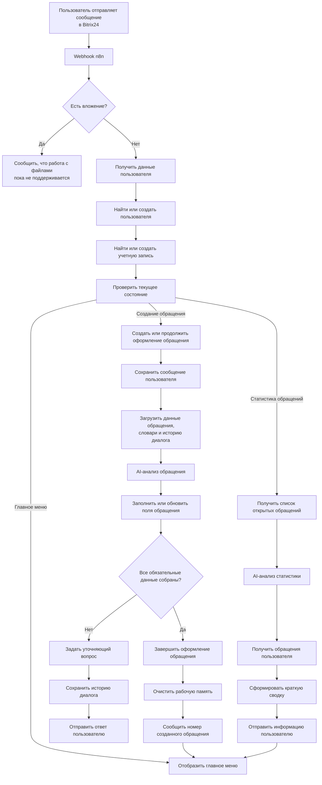
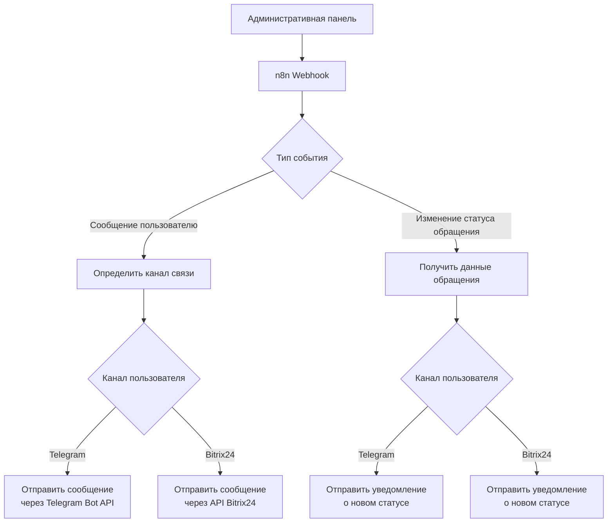

# ⚙️ Микро-сервис для технической поддержки с поддержкой ИИ
## В данном репозитории описывается сервис для организации внутренней техподдержки с поддержкой мультиагентной системы

---

## 📋 Описание проекта

Микросервис внутренней технической поддержки с поддержкой AI-агентов, который позволяет автоматизировать процесс регистрации, 
обработки и сопровождения обращений пользователей.

Пользователь взаимодействует с системой через привычные ему корпоративные каналы связи. 
Далее запрос поступает в оркестратор бизнес-процессов где автоматически выполняются идентификация пользователя, 
создание или продолжение обращения, анализ истории диалога и запуск AI-агентов.

AI-агент (который общается с пользователем) помогает пользователю сформулировать обращение, собрают недостающую информацию, 
уточняет детали, структурирует данные и сохраняет их в БД. 
После постановки тикета, он становится доступным специалистам техподдержки через административную веб-панель.

Помимо регистрации новых обращений, сервис предоставляет пользователям информацию о статусе уже существующих тикетов, ведет историю диалогов, 
журнал событий и обеспечивает единый жизненный цикл обработки тикетов — от первого сообщения пользователя до передачи задачи специалисту.

## 🛠 Технический стек

| 📌 Инструмент | 📋 Описание |
|-----------|------------|
| **Telegram bot** | Используется как интерфейс взаимодействия пользователя с СТП |
| **Bitrix24 robot (chat bot)** |  Используется как интерфейс взаимодействия пользователя с СТП |
| **N8N** | Орекстратор процессов и основной бэкенд обработчик |
| **Deepseek chat model** | LLM модель для организации работы AI-агентов |
| **MariaDB** | Основная БД для обработки данных о пользователях, диалогах и тикетах в СТП |
| **Python (Fast API) + JS** | Административная веб-панель для контроля и обработки тикетов специалистами СТП |

Более детально пройдемся по каждому пункту. 

- Telegram и Bitrix24 задействованы как каналы, через которые пользователь может обратиться в техподдержку.
Через эти же каналы пользователь взаимодействует с AI-агентом, со специалистом техподдержки, а так же получает системные уведомления, статусы и другую информацию по
своим обращениям в СТП.

- N8N задействован как конструктор workflow, он выполняет ключевые функции оркестратора процессов и бэкенд обработки:
    - Принимает вебхуки от Bitrix24 и Telegram
    - Автоматическая регистрация новых пользователей в БД
    - Создание и обработка тикета в рамках БД
    - Навигация по меню - создание нового тикета или просмотр статистики по текущим
    - AI-агенты:
        - Сбор информации по тикету
        - Уточняющие вопросы пользователю
        - вызов инструментов (Update, Select и др.) для обновления и получения данных из БД
        - Формирование и детализация статистики по запросу от пользователя
    - Сохранение контекста диалога с пользователем (Таблицы в БД)
    - Формирование и отправка сообщений пользователю обратно в Bitrix24/Telegram через HTTP-запросы к API

- Deepseek ипользуется для обеспечение работы AI-агентов в рамках сервиса. При желании можно использовать и другую LLM модель, 
но тогда, возможно, нужно будет править системные промпты агентов, т.к. каждая модель ведёт себя по-разному.

- MariaDB используется для хранения данных:
      - тикеты пользователей
      - пользовательские данные (персональные данные пользователей, инфо о канале связи и т.д.)
      - память агента
      - журнал событий (логгирование)
      - технические таблицы для маршрутизации потока и навигации пользователя в меню

- JS + CSS - фронтенд для административной панели, а Fast API бэкенд, редоставляющий REST API для работы специалистов технической поддержки.

---

## 📐 Архитектура обработки пользовательского обращения

Main workflow отвечает за полный жизненный цикл обращения пользователя — от первого сообщения до формирования структурированного тикета.

После получения сообщения из одного из каналов связи система определяет пользователя, выполняет его регистрацию (при необходимости) и восстанавливает текущий контекст диалога. 
Далее оркестратор (n8n) загружает историю взаимодействия, данные активного обращения и необходимые справочники, после чего передает управление AI-агенту.

AI-агент анализирует обращение, извлекает необходимую информацию, при необходимости задает уточняющие вопросы пользователю и последовательно заполняет структуру будущего тикета. 
На каждом этапе данные сохраняются в базе, что позволяет продолжить диалог без потери контекста.

После сбора всей обязательной информации обращение переводится в состояние готового тикета, сохраняется в системе и становится доступным специалистам технической поддержки. Пользователь получает подтверждение о регистрации обращения и может в дальнейшем отслеживать его статус через поддерживаемые каналы связи.

Схема главного воркфлоу:

## 📐 Архитектура обработки событий административной панели

Workflow отвечает за обработку событий, поступающих из административной веб-панели, и доставку уведомлений пользователям.

После получения события по Webhook система определяет его тип, извлекает необходимые данные об обращении и определяет предпочтительный канал связи пользователя. В зависимости от типа события формируется соответствующее уведомление, которое автоматически отправляется через поддерживаемый канал взаимодействия.

Такой подход обеспечивает единый механизм доставки сообщений независимо от используемой платформы и позволяет специалистам технической поддержки взаимодействовать с пользователями напрямую из административной панели без учета особенностей конкретного канала связи.

Схема workflow обработки:

---

## ❓ Какие задачи решает продукт

Разработанный сервис автоматизирует процесс внутренней техподдержки и позволяет значительно сократить время обработки пользовательских обращений.

Основные задачи, которые решает система:

* автоматическая регистрация и маршрутизация обращений пользователей;
* снижение нагрузки на специалистов за счет AI-помощника, который собирает и структурирует необходимую информацию до передачи обращения оператору;
* сокращение количества неполных или некорректно оформленных заявок благодаря уточняющим вопросам AI-агента;
* централизованное хранение истории обращений, сообщений и изменений статусов;
* единый механизм взаимодействия с пользователями через несколько каналов связи;
* автоматическое информирование пользователей об изменениях статуса обращения
* предоставление специалистам единого интерфейса для обработки обращений независимо от канала поступления сообщения;
* модульная архитектура, позволяющая расширять систему новыми каналами связи, AI-моделями и дополнительными бизнес-процессами.
